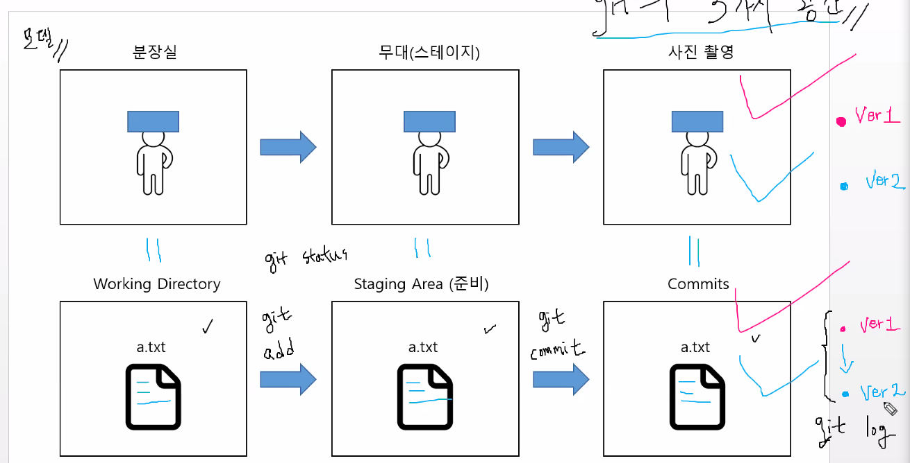

# CLI

1. CLI 란?
   - Command Line Interface
   - 터미널을 통해 사용자와 컴퓨터가 상호 작용하는 방식
   - GUI
     - Graphic User Interface
     - 그래픽을 통해 사용자와 컴퓨터가 상호 작용하는 방식
     - 현재 PC의 대중화 요인 중 하나
2. **Git Bash**
   - UNIX 계열 운영체제의 명령어

---

# Git bash 구성 및 동작

1. **경로**

   - 디렉토리
     - 루트 디렉토리; Root Directory `/` - /c: 

     - 홈 디렉토리; Home Directory  `~` - (/c:/Users/현재 사용자 계정)

   - 절대경로와 상대경로
     - 절대경로 : `/c:/Users/name/Desktop`
     - 상대경로 : (~~/c:/Users/~~)`name/Desktop`
       - `./` : 현재 작업하고 있는 폴더
       - `../` : 현재 작업하고 있는 폴더의 부모 폴더

2. **터미널 명령어** (현재 작업하고 있는 디렉토리에서 발생)

   1. 생성 

      - `mkdir '폴더명'` : 폴더를 생성 (make directory)
      - `touch 파일명.확장자` : 파일을 생성

   2. 삭제 

      - `rm 파일명.확장자` : 파일 삭제
      - `rm -r '폴더명'` : 폴더 삭제 

   3. 확인

      - `ls` : 폴더/파일 목록을 보여줌 (list segments)

        \- `-a` : 숨김 파일 까지 모두 보여줌 (all)

        \- `-l` : 파일 정보를 자세히 보여줌 (long)

   4. 이동

      - `cd` : 현재 작업중 디렉토리를 변경 (change directory)

        \- `cd`, `cd ~` : 홈 디렉토리로 이동

        \- `cd ..` : 부모 디렉토리로 이동

        \- `cd -` : 직전 디렉토리로 이동

   5. 열기

      - `start 폴더명` : 폴더 열기
      - `start 파일명.확장자` : 파일 열기

   6. 단축키

      - `ctrl + l`: 터미널 화면 정리

---

# Git

- Git : 분산 버전 관리 프로그램
  - 백업, 복구 협업에 편리하며 효율적
  - 유사 프로그램의 사용률은 전세계에서 최고

## Git 초기 설정

1. Git을 이용한 버전관리 작성자 등록 

   ```
   git config --global user.name "name"
   
   git config --global user.email name@gmail.com 
   ```

2. 작성자 등록 확인하기

   ```
   git config --global --list
   ```

   

## Git 명령어

1. Git으로 버전관리를 시작 : Working Directory 시작

   ```
   git init
   ```

2. Git이 관리하는 파일의 상태 확인

   ```
   git status
   ```

3. Working Directory -> Staging Area 로 이동

   ```
   git add 파일명.확장자
   ```

   - add한 파일은 버전관리의 대상이 됨
   - 인덱스 추가됨 : `.git/index` 내에 존재함

4. Staging Area -> Commit 로 이동

   ```
   git commit -m "이유작성"
   ```

   - 버전으로 등록됨
   - `-m` : message

5. Commit 로그 보여줌 : 버전이 갱신된 내역 확인

   - `-p` : 갱신된 내용 확인

   ```
   git log
   
   git log -p
   ```

6. Git 버전관리 해제

   ```
   rm -rf .git
   ```

7. 원격 저장소 연결

   ```
   git remote add origin https://github.com/name/TIL.git
   ```

8. 원격 저장소 연결 여부 확인

   ```
   git remote -v
   
   origin  https://github.com/name/TIL.git (fetch)
   origin  https://github.com/name/TIL.git (push) 
   ```

# Git의 3가지 공간


