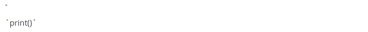

# Markdown

1. Typora ?
   - 마크다운 문법을 읽고 쓰기위한 메모장
2.  Markdown ?
   - 일반 텍스트 기반의 경량 마크업 언어
   - `파일명.md` 확장자를 가짐
   - 개발과 관련된 다수 문서의 형식


## 	Markdown 문법

1. 제목 (Headings)

   - 문법

   ``` 
   # 제목 1
   ## 제목 2
   ### 제목 3
   #### 제목 4
   ##### 제목 5
   ###### 제목 6
   ```

   - 결과

     

---

2. 목록 (List)

   - 순서가 없는 목록 : `-, *, +`

   - 순서가 있는 목록 : `1., 2., 3.`

   - 문법

     ```
     - 순서가 없는 목록
     	- 목록 1
     	- 목록 2
     
     1. 순서가 있는 목록
     	1. 목록 1
     	2. 목록 2
     ```

   - 결과

     

   - `tab 키` 를 이용하여 들여쓰기 가능

   - `shift + tab 키` 는 단계 올리기 가능

---

3. 강조 (Emphasis)

   - 문법

   ```
   1. 기울임(이탤릭체) : *글자*, _글자_
   2. 굵게(볼드체) : **글자**, __글자__
   3. 취소선 : ~~글자~~
   ```

   - 결과

   

---

4. 코드 (Code)

   - 인라인코드 : ` 백틱 사용

   ```
   파이썬에는 `print("hello World!")` 라고 쓸 수 있습니다.
   ```

   - 결과

   

   - 블록코드 : ``` 백틱 3회 사용

   ````
   ```python
   for i in range(10):
   	print(i)
   ```
   ````

   - 결과

   

---

5. 수평선 (Horizontal Rule)

   - 구분선 생성 : `-, *, _`을 3번 연속 작성

   - 문법

   ```
   ---
   ***
   ___
   ```

   - 결과

   

---

6. 표 (Table)

   - 테이블 생성
     - `파이프(|)`, `하이픈(-)`을 이용해서 행, 열을 구분
     - 헤더 구분은 `3개 이상의 하이픈(-)`으로 가능
     - Typora에서는 `ctrl + T`로 표 생성 가능
     - `ctrl + enter`로 행 추가 가능
   - 문법

   ```
   | 동물   | 다리 개수 | 종     |
   | ------ | --------- | ------ |
   | 사자   | 4개       | 포유류 |
   | 원숭이 | 2개       | 포유류 |
   | 앵무새 | 2개       | 조류   |
   |        |           |        |
   ```

   - 결과

   

---

7. 문자열 이스케이프(escape)

   - 문법 적용을 안하고 싶을 때 `\` 를 사용
   - 문법

   ```
   \-
   \`print()\`
   ```

   - 결과

   

---

8. 작성 그대로 보기
   - `ctrl + /` : markdown 효과없애고 작성한 그대로 나타냄
