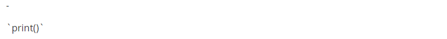
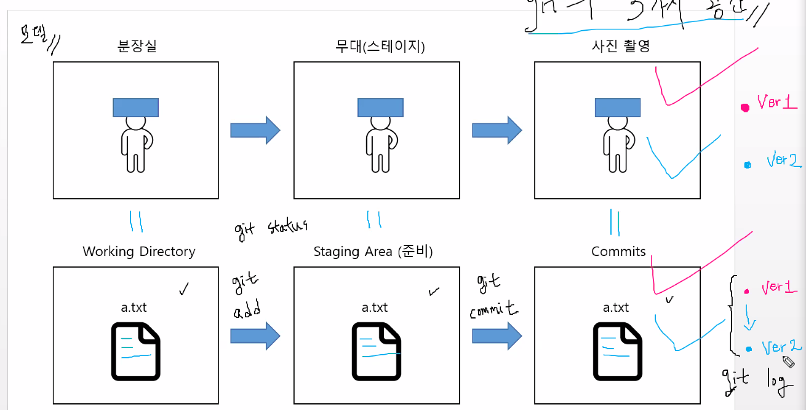

# CLI

1. CLI 란?
   - Command Line Interface
   - 터미널을 통해 사용자와 컴퓨터가 상호 작용하는 방식
   - GUI
     - Graphic User Interface
     - 그래픽을 통해 사용자와 컴퓨터가 상호 작용하는 방식
     - 현재 PC의 대중화 요인 중 하나
2. **Git Bash**
   - UNIX 계열 운영체제의 명령어


## 	Git bash 구성 및 동작

1. **경로**
   
   - 디렉토리
     - 루트 디렉토리; Root Directory `/` - /c: 
     
     - 홈 디렉토리; Home Directory  `~` - (/c:/Users/현재 사용자 계정)
     
   - 절대경로와 상대경로
     - 절대경로 : `/c:/Users/name/Desktop`
     - 상대경로 : (~~/c:/Users/~~)`name/Desktop`
       - `./` : 현재 작업하고 있는 폴더
       - `../` : 현재 작업하고 있는 폴더의 부모 폴더
   
2. **터미널 명령어** (현재 작업하고 있는 디렉토리에서 발생)
   
   1. 생성 
   
      - `mkdir '폴더명'` : 폴더를 생성 (make directory)
      - `touch 파일명.확장자` : 파일을 생성
   
   2. 삭제 
   
      - `rm 파일명.확장자` : 파일 삭제
      - `rm -r '폴더명'` : 폴더 삭제 
   
   3. 확인
   
      - `ls` : 폴더/파일 목록을 보여줌 (list segments)
   
        \- `-a` : 숨김 파일 까지 모두 보여줌 (all)
   
        \- `-l` : 파일 정보를 자세히 보여줌 (long)
   
   4. 이동
   
      - `cd` : 현재 작업중 디렉토리를 변경 (change directory)
   
        \- `cd`, `cd ~` : 홈 디렉토리로 이동
   
        \- `cd ..` : 부모 디렉토리로 이동
   
        \- `cd -` : 직전 디렉토리로 이동
   
   5. 열기
   
      - `start 폴더명` : 폴더 열기
      - `start 파일명.확장자` : 파일 열기
   
   6. 단축키
   
      - `ctrl + l`: 터미널 화면 정리


---

---


# Markdown

1. Typora ?
   - 마크다운 문법을 읽고 쓰기위한 메모장
2.  Markdown ?
   - 일반 텍스트 기반의 경량 마크업 언어
   - `파일명.md` 확장자를 가짐
   - 개발과 관련된 다수 문서의 형식


## 	Markdown 문법

1. 제목 (Headings)

   - 문법

   ``` 
   # 제목 1
   ## 제목 2
   ### 제목 3
   #### 제목 4
   ##### 제목 5
   ###### 제목 6
   ```

   - 결과

     

---

2. 목록 (List)

   - 순서가 없는 목록 : `-, *, +`

   - 순서가 있는 목록 : `1., 2., 3.`

   - 문법

     ```
     - 순서가 없는 목록
     	- 목록 1
     	- 목록 2
     
     1. 순서가 있는 목록
     	1. 목록 1
     	2. 목록 2
     ```

   - 결과

     

   - `tab 키` 를 이용하여 들여쓰기 가능

   - `shift + tab 키` 는 단계 올리기 가능

---

3. 강조 (Emphasis)

   - 문법

   ```
   1. 기울임(이탤릭체) : *글자*, _글자_
   2. 굵게(볼드체) : **글자**, __글자__
   3. 취소선 : ~~글자~~
   ```

   - 결과

   

---

4. 코드 (Code)

   - 인라인코드 : ` 백틱 사용

   ```
   파이썬에는 `print("hello World!")` 라고 쓸 수 있습니다.
   ```

   - 결과

   

   - 블록코드 : ``` 백틱 3회 사용

   ````
   ```python
   for i in range(10):
   	print(i)
   ```
   ````

   - 결과

   

---

5. 수평선 (Horizontal Rule)

   - 구분선 생성 : `-, *, _`을 3번 연속 작성

   - 문법

   ```
   ---
   ***
   ___
   ```

   - 결과

   

---

6. 표 (Table)

   - 테이블 생성
     - `파이프(|)`, `하이픈(-)`을 이용해서 행, 열을 구분
     - 헤더 구분은 `3개 이상의 하이픈(-)`으로 가능
     - Typora에서는 `ctrl + T`로 표 생성 가능
     - `ctrl + enter`로 행 추가 가능
   - 문법

   ```
   | 동물   | 다리 개수 | 종     |
   | ------ | --------- | ------ |
   | 사자   | 4개       | 포유류 |
   | 원숭이 | 2개       | 포유류 |
   | 앵무새 | 2개       | 조류   |
   |        |           |        |
   ```

   - 결과

   

---

7. 문자열 이스케이프

   - 문법 적용을 안하고 싶을 때 `\` 를 사용
   - 문법

   ```
   \-
   \`print()\`
   ```

   - 결과

   

---

8. 작성 그대로 보기
   - `ctrl + /` : markdown 효과없애고 작성한 그대로 나타냄


---

---

---


# Git

- Git : 분산 버전 관리 프로그램
  - 백업, 복구 협업에 편리하며 효율적
  - 유사 프로그램의 사용률은 전세계에서 최고


---

## Git 초기 설정

1. Git을 이용한 버전관리 작성자 등록 

   ```
   git config --global user.name "name"
   
   git config --global user.email name@gmail.com 
   ```

2. 작성자 등록 확인하기

   ```
   git config --global --list
   ```

   

## Git 명령어

1. Git으로 버전관리를 시작 : Working Directory 시작

   ```
   git init
   ```

2. Git이 관리하는 파일의 상태 확인

   ```
   git status
   ```

3. Working Directory -> Staging Area 로 이동

   ```
   git add 파일명.확장자
   ```

   - add한 파일은 버전관리의 대상이 됨
   - 인덱스 추가됨 : `.git/index` 내에 존재함

4. Staging Area -> Commit 로 이동

   ```
   git commit -m "이유작성"
   ```

   - 버전으로 등록됨
   - `-m` : message

5. Commit 로그 보여줌 : 버전이 갱신된 내역 확인

   - `-p` : 갱신된 내용 확인

   ```
   git log
   
   git log -p
   ```

6. Git 버전관리 해제

   ```
   rm -rf .git
   ```

7.  원격 저장소 연결

   ```
   git remote add origin https://github.com/name/TIL.git
   ```

8. 원격 저장소 연결 여부 확인

   ```
   git remote -v
   
   origin  https://github.com/name/TIL.git (fetch)
   origin  https://github.com/name/TIL.git (push) 
   ```

9. 

# Git의 3가지 공간


