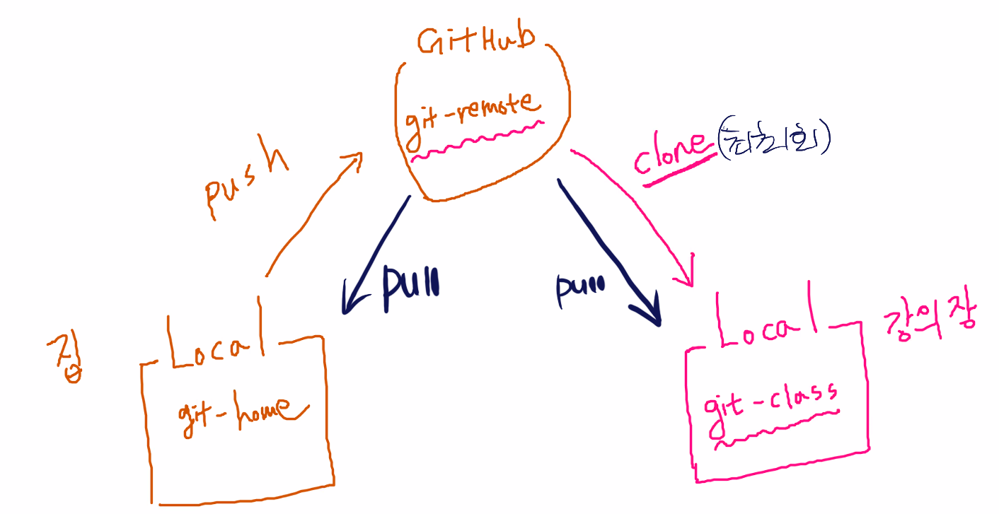

# Github

- 내 컴퓨터의 로컬 저장소와 대비되는 원격 저장소 (Remot Repository)
- 다른 사람과 공유, 협업을 위하여 사용


---


# Local - Github 연결하기

	### 1. Local 설정

- 홈 디렉토리 - `로컬저장소` 폴더 생성 (폴더명 자유)

- `로컬저장소` 폴더 내에서 CLI 이용 하여 초기화

  ```
  git config --global user.name "name"			# user name 설정
  git config --global user.email name@gmail.com 	# user email 설정
  
  git init										# git 초기화
  ```


### 2. Github 설정

- Github 가입 - New repository - Repository name 설정 - Create repository
- `원격저장소` 의 주소 확인


### 3. Local - Github 연결 명령어

- 연결하기

  ```
  git remote add NICKNAME http://github.com/....	# 원격저장소 주소
  ```

- 원격저장소 조회

  ```
  $ git remote -v
  NICKNAME http://github.com/.... (fetch)
  NICKNAME http://github.com/.... (push)
  ```

- 연결 해제

  ```
  git remote rm NICKNAME
  git remote remove NICKNAME
  ```

  - Local 과 Remote 의 연결을 끊는 것, `원격저장소` 를 삭제하는 것 아님


---


# Github 사용하기

### 1. Upload

1. Local 에서 Commit 생성

   - 현재 상태 확인

     ```
     git status
     ```

   - [빨강] 파일 Staging Area에 올리기

     ```
     git add README.md
     ```

     - `git add .` 은 새로운 모든 폴더/파일을 SA에 올림

   - [초록] 파일 Commit 하기

     ```
     git commit -m "버전명"
     ```

     - `원격저장소` 에 표시할 버전명을 적어줌

   - Commit 확인 하기

     ```
     git log --oneline
     ```

     - Commit 을 하면 고유값이 생기는데, 이것을 `commit ID`, `해시값`, `SHA1`로 부르며 중복되지 않음

2.  `원격저장소` 에 업로드

   ```
   git push NICKNAME BRANCHES
   ```

   - BRANCHES 는 `Github - Repositories` 에서 설정 가능 : 작업의 메인이 되는 곳


---

### 2. .gitignore ?

- 특정 파일 혹은 폴더에 대해 Git이 버전관리를 하지 못하도록 지정하는 것
  - 민감한 정보가 담긴 파일 등 공유되면 안되는 파일
- 반드시 `.gitignore` 로 작성 !!!
- 반드시 `.git` 폴더와 동일한 위치에 생성 !!!
- 자동으로 지정 파일 잡아주는 사이트
  - https://gitignore.io


---


# Git - clone, pull

- 공동작업자와 협업하기 위한 설정 및 명령어
- 하나의 `원격저장소` 에 공동 작업자가 있을 때, 아래와 같은 구조를 이룸


